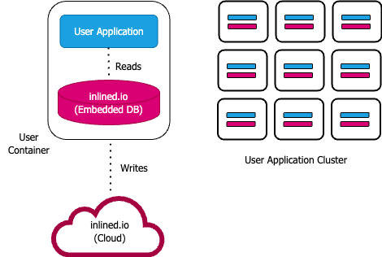

# IKV | Inlined Key-Value Store
IKV is a high performance **fully-managed embedded database**, for powering modern ML inference. It's unique design makes it perfect for accessing large key-value datasets with very low latency in a production setting.

An [embedded database](https://en.wikipedia.org/wiki/Embedded_database) provides much better performance (response-time and throughput) as compared to standalone services (ex. Redis or DynamoDB), by integrating directly into the user application and avoiding any remote network calls. IKV is -

 1. **Blazing Fast**: IKV provides **single-digit microsecond** P99 read latency from client’s point-of-view. This is 100x faster than existing solutions like Redis.
 2. **Persistent Storage**: Write once and read forever. IKV embedded database is built on top of a reliable data layer (i.e. IKV cloud).
 3. **Environment Agnostic**: Run in the public-cloud (AWS/Azure/GCP, etc) or on-prem with no differences in read-performance or configuration.
 4. **Horizontally Scalable**: Handles large datasets (with partitions) and high read/write traffic (with replication). Built for streaming and batch ingestion of data.

## Benchmarks | 100x faster than Redis
IKV is eventually-consistent, in-memory (with option to spill to disk) and trades-off write performance for reads. These design choices enable extremely low-latency read access to key value data. IKV provides **single-digit microsecond response-time at P99** and is **100x faster than Redis**.

Read our full benchmarking setup and report [here](https://docs.google.com/document/d/1aDsS0V-AybpvXEwblBlahGLpKH5NmUmi6mTWGsbABGk/edit#heading=h.ey4ngxmm384e).

```markdown
| Read-Only Load (QPS) | IKV (Inlined Key Value Store)   | Redis Cluster (AWS ElastiCache) |
|----------------------|---------------------------------|---------------------------------|
|                      | Response Time (micro-seconds)   | Response Time (micro-seconds)   |
|                      |                                 |                                 |
| 25K                  | avg: 2.77, p50: 2.58, p99: 5.34 | avg: 317, p50: 306, p99: 5279   |
| 50K                  | avg: 3.05, p50: 2.91, p99: 5.97 | avg: 321, p50: 308, p99: 533    |
| 100K                 | avg: 3.13, p50: 2.89, p99: 5.65 | avg: 319, p50: 305, p99: 514    |
| 1M                   | avg: 2.93, p50: 2.56, p99: 4.92 | Not Achievable                  |
| 3M                   | avg: 4.09, p50: 2.43, p99: 3.83 | Not Achievable                  |
```

These benchmarks were performed by a multi-threaded client machine which made blocking calls to the underlying database. For a constant load (queries-per-second), we note down the response-time of both databases (avg/P99/etc). We tested "get" performance i.e. given a primary-key and a field/attribute name - fetch the field's value. IKV is inherently built for multithreaded use, for Redis we used a 16 shard, single-node Redis Cluster to ensure fairness. The report linked above has details about hardware and testing methodology.

## Quick Links
 - Getting Started
	 - [Provisioning](#provisioning)
	 - [Java](#getting-started-with-java)
	 - Python & Go (upcoming - July 2024)
 - [APIs](#apis)
 - [Architecture](#architecture)
 - [Technical Support](#technical-support)
## Provisioning
You need an IKV account and a provisioned key-value store to start using IKV in production. Why? IKV is an embedded database which is built on top of a persistent stand-alone data layer (which needs resource allocation). To provision (provisioning time is usually less than 12 hrs), reach out to to - **onboarding@inlined.io**, with the following - 
 - Existing **account-id** (if exists, else mention you want a new account-id and account-passkey).
 - For store provisioning: **store-name, primary-key, partitioning key (optional)**. See [APIs](#apis) to familiarize yourself with some of these terms.
 - Once you have an account-id, account-passkey and have provisioned a new store, you're all set to start using IKV.

## Getting Started with Java
In this section we go over some code samples about how to use IKV's client library in your Java project. Please reach out to *onboarding@inlined.io* for any support/questions related to usage.

#### Installation
`ikv-java-client` dependency is hosted on [Jitpack](https://jitpack.io/#io.inlined/ikv-java-client), add dependency to your Gradle/Maven Java project. Make sure to use the latest version from [release list](https://jitpack.io/#io.inlined/ikv-java-client).
```
repositories {
  maven { url 'https://jitpack.io' }
}

dependencies {
  implementation 'io.inlined:ikv-java-client:0.0.7'
}
```

```
<repositories>
  <repository>
    <id>jitpack.io</id>
    <url>https://jitpack.io</url>
  </repository>
</repositories>

<dependency>
  <groupId>io.inlined</groupId>
  <artifactId>ikv-java-client</artifactId>
  <version>0.0.7</version>
</dependency>
```

#### Java Usage
Prerequisites - (1) [Provisioned](#provisioning) IKV store  (2) Basic familiarity with [IKV APIs and concepts](#apis)

```
// Instantiate reader and writer clients using IKVClientFactory.
// In this example we will upsert and read "user" profile data - the same example
// which was discussed in IKV APIs section linked above.

import io.inlined.clients.ClientOptions;  
import io.inlined.clients.IKVClientFactory;  
import io.inlined.clients.IKVDocument;  
import io.inlined.clients.InlineKVReader;  
import io.inlined.clients.InlineKVWriter;

IKVClientFactory factory = new IKVClientFactory();

// Create client options - for Writer
ClientOptions writerClientOptions = new ClientOptions.Builder()
  .withStoreName("user-profile")  
  .withAccountId("--account-id--")  
  .withAccountPassKey("--account-passkey--")
  .build();

// Create Writer instance
InlineKVWriter writer = factory.createNewWriterInstance(writerClientOptions);
writer.startupWriter();

// create documents and invoke upsert() operations
IKVDocument doc1 =  new IKVDocument.Builder()
  .putStringField("firstname", "Alice")
  .putIntField("age", 22)
  .build();  
writer.upsertFieldValues(doc1);

IKVDocument doc2 =  new IKVDocument.Builder()
  .putStringField("firstname", "Alice")
  .putStringField("city", "San Francisco")
  .build();  
writer.upsertFieldValues(doc2);

IKVDocument doc3 =  new IKVDocument.Builder()
  .putStringField("firstname", "Bob")
  .putIntField("age", 25)
  .build();  
writer.upsertFieldValues(doc3);

// Create client options - for Reader
ClientOptions readerClientOptions = new ClientOptions.Builder()
  .withMountDirectory("/tmp/UserProfiles)  
  .withStoreName("user-profile")  
  .withAccountId("--account-id--")  
  .withAccountPassKey("--account-passkey--")  
  .useStringPrimaryKey()  
  .build();

// Create Reader instance
InlineKVReader reader = factory.createNewReaderInstance(readerClientOptions);  
reader.startupReader();

// read documents
// Due to eventual-consistent nature of IKV, you might need to add a small delay (or retries)
// before reading your writes.
Thread.sleep(1000);

Assertions.assertEquals(reader.getStringValue("Alice", "firstname"), "Alice");
Assertions.assertEquals(reader.getIntValue("Alice", "age"), 22);
Assertions.assertEquals(reader.getStringValue("Alice", "city"), "San Francisco");

Assertions.assertEquals(reader.getStringValue("Bob", "firstname"), "Bob");
Assertions.assertEquals(reader.getIntValue("Bob", "age"), 25);
Assertions.assertNull(reader.getStringValue("Bob", "city"));

writer.shutdownWriter();
reader.shutdownReader();
```


## APIs
In this section we go over some important interfaces and abstractions that IKV provides as a key-value database. 

These concepts are language independent. IKV stores documents (the "value") associated with primary-keys (the "key"), in an [eventually consistent](https://en.wikipedia.org/wiki/Eventual_consistency) (read-after-write) manner. Given a primary-key, a user can do CRUD operations i.e. create/read/update/delete for a single document (batch operations are also supported).

##### Document
A document is a collection of fields/attributes. Each inner field/attribute contained within a document is optional (i.e. it's value can be missing), and can be used to store a particular property of the document. This is analogous to a "single row" of data in many SQL databases or something like DynamoDB, with each "column" being an inner field/attribute. 

A field can be uniquely identified by a **name** and a **type** - which is the same across all documents stored in a particular IKV store. Fields (except primary and partitioning keys) are not required to be declared while provisioning or in a "schema/configuration" file, instead IKV updates field information dynamically as and when they are encountered at runtime.

##### Field Types
Supported types include - 
 - **Numeric**: int32, int64, float32, float64 - Can be used to store signed integer and floating point numbers of size 4 and 8 bytes.
 - **String**: A sequence of UTF8 characters. Language specific IKV clients generate functions/methods that use language specific types to represent strings (ex. `java.lang.String` in Java).
 - **Bytes**: A sequence of 8-bit values or raw bytes. This type is quite useful to model complex types. ex. 
	 - Storing a list of float64: which can be done by creating a custom encode/decoder which stores the number of float64's in the list followed by the actual floats as a fixed-width 8 byte entity.
	 - Storing complex/nested data: which can be done by leveraging serialization frameworks like Protobuf, Json, etc. - creating application specific objects and then converting them into raw bytes.

##### Primary Key
Primary Key is a unique identifier for a document and is itself a required field/attribute of the document. It can be of type string or bytes, and should be used for all CRUD operations on documents.

##### Partitioning Key
Since IKV is an embedded database, after a certain size all documents cannot fit in a single machine/host - hence partitioning keys are used to distribute documents across multiple hosts (i.e. partitions/shards). A user can declare an optional partitioning key (defaults to the primary key if missing), which itself is a required field/attribute of the document. It can be of type string or bytes. It is only relevant for write (create/update/delete) operations.

##### Operations
IKV supports the following operations on documents (for single/batch of documents) - 
 1. **Upsert**: Insert or Update-if-exists a document, given the document's fields (primary, partitioning keys and other fields). Upserts need not contain all field values as part of the same operation - fields get unionized to the same document, as and when they are published.
 2. **Delete**: Delete a document or specific fields from a document, given the document's primary and partitioning (if applicable) key.
 3. **Read**: Read a particular field(s) for a document, given its primary key. NOTE - Read operations are [eventually-consistent](https://en.wikipedia.org/wiki/Eventual_consistency) w.r.t upsert and delete operations, i.e. there will be small delay (usually in order of milliseconds) before changes to a document's fields are reflected in read operations.
 
##### Illustration
Let's consider an example where we want to store user profile's in an IKV store called - *users*. A user profile contains their (1) first-name (2) age (3) city.

To represent this data-model, we first think of how our IKV document would look like. Each document can represent  a particular profile, which is uniquely identified by their *firstname*. We will need the following types - 

 - Field-Name: firstname, Field-Type: String
 - Field-Name: age, Field-Type: int32
 - Field-Name: city, Field-Type: String

Document Construction:
```
Upsert#Alice
{
  "firstname": "Alice",
  "age": 22
}

Upsert#Alice
{
  "firstname": "Alice",
  "city": "San Francisco"
}

Upsert#Bob
{
  "firstname": "Bob",
  "age": 25
}
```

Reads:
```
"Alice#firstname" -> "Alice"
"Alice#age" -> 22
"Alice#city" -> "San Francisco"

"Bob#firstname" -> "Bob"
"Bob#age" -> 25
"Bob#city" -> // empty
```

## Architecture
This section has a bird's eye view of IKV's architecture.



IKV has a hybrid architecture wherein, the database reads are served from an embedded database but writes are persisted and propagated using a standalone service (i.e. IKV Cloud).

 1. **Reader/Writer Clients**: Distributed as language specific libraries, this is how users perform all CRUD operations. The writer client publishes the events to IKV Cloud, while the reader client queries the embedded database which is up-to-date with latest data (in near real-time).
 2. **IKV Cloud**: Gateway for write operations. It distributes incoming writes to readers using Kafka streams. It also serves other essential tasks like building index images periodically (for bootstrapping new readers), serving configuration, etc.
 3. **Embedded database**: Written in Rust, this component is the core database engine used by readers. Clients interface with this using foreign function interface (ex. JNI for Java). The key data structures include: (1) sharded memory-mapped files which store serialized field values (2) hash-table which indexes primary-keys versus "offsets" into the mmaps. This design enables highly concurrent key-value lookup. For most scenarios, all of the data will reside in RAM, providing high performance.

## Technical Support
For provisioning, documentation or any technical support- onboarding[@]inlined.io

