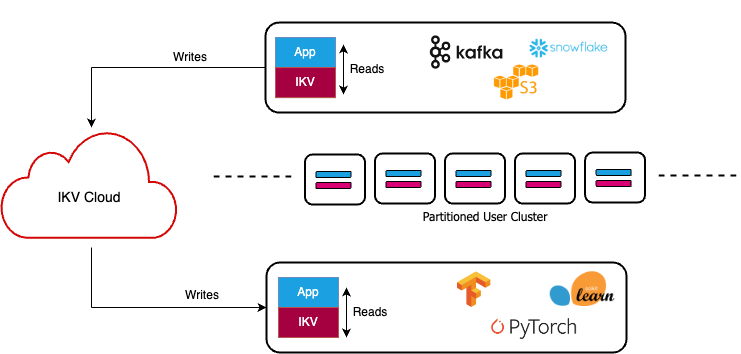

<p align="center">
    
</p>

Website: **[inlined.io](https://inlined.io)** | Documentation: **[docs.inlined.io](https://docs.inlined.io)**

# IKV | Inlined Key-Value Store
IKV is a key-value store primarly designed for storing ML features. It is persistent, [eventually-consistent](https://en.wikipedia.org/wiki/Eventual_consistency) and most importantly an [embedded database](https://en.wikipedia.org/wiki/Embedded_database). IKV is written in Rust, and provides SDKs (client libraries) in **Python, Go and Java**. 

Most key-value stores (think Redis or Cassandra) need a remote database cluster, whereas IKV allows you to utilize your existing application infrastructure to store data (cost efficient) and access it without any network calls (better performance).

<p align="center">
    
</p>

#### Cost-effective caching at sub-millisecond speed
Most key-value stores require you to allocate a dedicated database cluster which is costly (hardware + operations). IKV allows you to augment your existing application cluster with additional memory or Flash/SSD to store your data, without sacrificing on speed. 
 - Sub-millisecond access latency when used with local (attached) Flash/SSD storage, which is still 2x faster than a remote all-in-memory Redis cluster. (See [benchmarks](#benchmarks--100x-faster-than-redis) below)
 - Automatic data-tiering and zero-copy disk reads. IKV's memory-mapped index keeps frequently accessed data in memory and the rest automatically spills to disk (no need for configuration).
 - Auto-scaling friendly. IKV can be used as a library, i.e. it auto-scales with your existing application cluster. Traditional database clusters need to be provisioned for peak-load at all times.

#### Embedded and blazing fast
IKV can serve read requests without making any network calls, and can provide **single-digit microsecond** P99 read latency, when your dataset can fit in memory (sub-millisecond when used with Flash/SSD). This is **100x faster than existing solutions like Redis**. (See [benchmarks](#benchmarks--100x-faster-than-redis) below)

IKV is heavily optimized for read performance (latency and throughput):
 - Zero network latency for reads (even on a cold start). No overhead of network hops, encryption and minimal ser-deserialization.
 - Frequently accessed data occupies local memory.
 - No need for index compaction (like LSM tree based stores), hence there is no resource saturation. 
 - No Garbage Collection. IKV is written in Rust with client SDKs in Python, Go and Java.

#### Fully-managed, more than a library
Traditional embedded databases (like RocksDB or LevelDB) are just libraries, IKV does way more:
 - Data is fully persistent. Write once and read forever, without the need to perform any explicit backups or snapshots.
 - Geo-replicated. IKV's underlying data-plane (IKV Cloud or self-hosted) replicates your data globally across your application clusters.
 - Horizontal scaling - IKV scales horizontally for large datasets (with partitions) and high read/write traffic (with replication).

#### Usecases for IKV
IKV's primary usecase is for storing ML features for online retrieval - as part of ML inference/scoring for applications like recommendation engines, search, ecommerce, etc.
It can also be used for fast general-purpose storage/caching - anything with tight latency requirements and doesn't need read-after-write consistency.

## Benchmarks | 100x faster than Redis
IKV provides single-digit microsecond response-time at P99 and is 100x faster than Redis. Read our full benchmarking setup and report [here](https://docs.google.com/document/d/1aDsS0V-AybpvXEwblBlahGLpKH5NmUmi6mTWGsbABGk/edit#heading=h.ey4ngxmm384e).

```markdown
| Read-Only Load (QPS) | IKV (Inlined Key Value Store)   | Redis Cluster (AWS ElastiCache) |
|----------------------|---------------------------------|---------------------------------|
|                      | Response Time (micro-seconds)   | Response Time (micro-seconds)   |
|                      |                                 |                                 |
| 25K                  | avg: 2.77, p50: 2.58, p99: 5.34 | avg: 317, p50: 306, p99: 527    |
| 50K                  | avg: 3.05, p50: 2.91, p99: 5.97 | avg: 321, p50: 308, p99: 533    |
| 100K                 | avg: 3.13, p50: 2.89, p99: 5.65 | avg: 319, p50: 305, p99: 514    |
| 1M                   | avg: 2.93, p50: 2.56, p99: 4.92 | Not Achievable                  |
| 3M                   | avg: 4.09, p50: 2.43, p99: 3.83 | Not Achievable                  |
```

These benchmarks were performed by a multi-threaded client machine which made blocking calls to the underlying database. For a constant load (queries-per-second), we note down the response-time of both databases (avg/P99/etc). We tested "get" performance i.e. given a primary-key and a field/attribute name - fetch the field's value. IKV is inherently built for multithreaded use, for Redis we used a 16 shard, single-node Redis Cluster to ensure fairness. The report linked above has details about hardware and testing methodology.

## Developer Documentation
Detailed documentation about data-modeling, best practices and language specific client SDKs and more: **[docs.inlined.io](https://docs.inlined.io)**

## Using IKV
IKV is an embedded database, but it is built on top of a data-plane (streams, block storage & config endpoints) which propagates new data to the embedded database instances. You can either use the data-plane hosted by inlined.io (IKV cloud) or self-host.

### IKV Cloud (data-plane hosted by inlined.io)
Use IKV in cloud enviornments - AWS, Azure, Google Cloud or on-prem. You need an IKV Cloud account and a provisioned IKV store to start - by contacting **onboarding@inlined.io** or booking an appointment at [https://inlined.io](https://inlined.io). IKV Cloud is a paid fully-managed service - where you get unlimited read quota, pay only for the amount of data you store ($ per GB/month).

### Self-Hosted (coming soon)
Host the containerized data-plane in your private cloud.

## Architecture
<p align="center">
    
</p>
IKV is composed of two parts - (a) an embedded database, which can be used as a library to store data in your application container (b) a data-plane (hosted by inlined.io or self-hosted), which persists data and propagates it to the database instances.

 1. **Reader/Writer Clients**: Distributed as language specific libraries, this is how users perform all CRUD operations. The writer client publishes the events to IKV's data plane (IKV Cloud), while the reader client queries the embedded database which is up-to-date with latest data (in near real-time).
 2. **IKV Data Plane**: Gateway for write operations. It distributes incoming writes to readers using Kafka streams. It also serves other essential tasks like building index images periodically (for bootstrapping new readers), serving configuration, etc.
 3. **Embedded database**: Written in Rust, this component is the core database engine used by readers. Clients interface with this using foreign function interface (ex. JNI for Java). The key data structures include: (1) partitioned memory-mapped files which store serialized field values (2) hash-table which indexes primary-keys versus "offsets" into the mmaps. This design enables highly concurrent key-value lookup. Data occupies RAM/memory and automatically spills to configured disk (local/remote).

## APIs
IKV stores documents (the "value") associated with primary-keys (the "key"), in an [eventually consistent](https://en.wikipedia.org/wiki/Eventual_consistency) (read-after-write) manner. Given a primary-key, a user can do CRUD operations i.e. create/read/update/delete on documents.

### Glossary
- **Document**: Analogous to a row/object/entity of data in databases. Every IKV stores data in the form of documents.
- **Fields**: Analogous to columns in a row of data or attributes of an entity. A document is comprised of multiple strongly typed attributes known as fields.
- **Primary Key**: A field which can be used to uniquely identify a document. The field to be used as the primary-key is set upon IKV store provisioning and cannot be changed later.
- **Partitioning Key**: A field which can be used to segregate a document into different shards/partitions for the embedded key-value store. Using a partitioning key is optional, if done, it needs to be set upon IKV store provisioning and cannot be changed later.

### Fields
Documents are comprised of fields. A field can be uniquely identified by a name (i.e. "field-name") and a type, which is the same across all documents stored in a particular IKV store. The following types of fields are supported:
 - **Numeric**: int32, int64, float32, float64 - Can be used to store signed integer and floating point numbers of size 4 and 8 bytes.
 - **String**: A sequence of UTF8 characters. Language specific IKV clients generate functions/methods that use language specific types to represent strings (ex. `java.lang.String` in Java).
 - **Bytes**: A sequence of 8-bit values or raw bytes. This type is quite useful to model complex types. ex. 
	 - Storing a list of float64: which can be done by creating a custom encode/decoder which stores the number of float64's in the list followed by the actual floats as a fixed-width 8 byte entity.
	 - Storing nested data: which can be done by leveraging serialization frameworks like Protobuf, Json, etc. - creating application specific objects and then converting them into raw bytes.

### Query Pattern
IKV can be queried as a key-value store. The "key" for a query (read request) is the primary-key for a document, along with a field-name. The "value" is the field-value stored in the document. There is also support to perform batch/multi lookup operations.

### Operations
IKV supports the following operations on documents (for single/batch of documents) - 
 1. **Upsert**: Insert or Update (if not exists) fields for a document. The document must contain the value of the primary-key and (if-specified) partitioning-key. Include values of other fields you wish to upsert. Different values for the same primary-key are aggregated by unionizing distincts and overwriting duplicates, ex. upsert of `{"name": "Alice", "age": 22}` followed by upsert of `{"name": "Alice", "age": 25, "city": "San Francisco"}` , results in `{"name": "Alice", "age": 25, "city": "San Francisco"}` being saved in IKV.
 2. **Delete**: Delete a document or specific fields from a document, given the document's primary and partitioning (if applicable) key.
 3. **Read**: Read a particular field(s) for a document, given its primary key. NOTE - Read operations are [eventually-consistent](https://en.wikipedia.org/wiki/Eventual_consistency) w.r.t upsert and delete operations, i.e. there will be small delay (usually in order of milliseconds) before changes to a document's fields are reflected in read operations.
 
### Example
Let's consider an example where we want to store "user profile" data in an IKV store called - *users*. A user profile contains their (1) first-name (2) age (3) city. To represent this data-model, we first think of how our IKV document would look like. Each document can represent a particular profile, which is uniquely identified by their *firstname*. We will need the following types - 
 - Field-Name: firstname, Field-Type: string
 - Field-Name: age, Field-Type: int32
 - Field-Name: city, Field-Type: string
We can create the following sets of documents to represent two users - "Alice" and "Bob".

```
Operation: Upsert#Alice
Document:
{
  "firstname": "Alice",
  "age": 22
}
```

At this stage, one document is indexed in the store, and two fields exist in each document i.e. "firstname" and "age"

```
Operation: Upsert#Alice
Document:
{
  "firstname": "Alice",
  "city": "San Francisco"
}
```

We added a new field "city" to each document, and updated the original document by adding a value for it.

```
Operation: Upsert#Bob
Document:
{
  "firstname": "Bob",
  "age": 25
}
```

We added a new document, no new fields were added. The following queries can be performed on IKV now:

```
"Alice#firstname" -> "Alice"
"Alice#age" -> 22
"Alice#city" -> "San Francisco"

"Bob#firstname" -> "Bob"
"Bob#age" -> 25
"Bob#city" -> // empty
```

## Language specific SDKs
IKV provides client SDKs in Python, Go and Java. Documentation: [docs.inlined.io](https://docs.inlined.io/category/clients)

### Python SDK
#### Installation
Fetch the latest version from [PyPi](https://pypi.org/project/ikvpy/) using **pip**.

```bash
python -m pip install ikvpy
```
#### Python Usage
Prerequisites - (1) [Provisioned](#onboarding) IKV store  (2) Basic familiarity with [IKV APIs and concepts](#apis)

```python
import time
from ikvpy.clientoptions import ClientOptions, ClientOptionsBuilder
import ikvpy.client as ikv_client
import ikvpy.document as ikv_document
import ikvpy.factory as ikv_factory

# create client options - for writer
client_options = ClientOptionsBuilder() \
	.with_account_id("--account-id--")\
	.with_account_passkey("--account-passkey--")\
	.with_store_name("--store-name--")\
	.build()

# create writer
writer: ikv_client.IKVWriter = ikv_factory.create_new_writer(client_options)
writer.startup()

# create documents and invoke upsert() operations
doc1 = ikv_document.IKVDocumentBuilder().put_string_field("firstname", "Alice").put_string_field("age", "22").build()
writer.upsert_fields(doc1) # can raise exception on error, see source docs

doc2 = ikv_document.IKVDocumentBuilder().put_string_field("firstname", "Alice").put_string_field("city", "San Francisco").build()
writer.upsert_fields(doc2) # can raise exception on error, see source docs

doc3 = ikv_document.IKVDocumentBuilder().put_string_field("firstname", "Bob").put_string_field("age", "25").build()
writer.upsert_fields(doc3) # can raise exception on error, see source docs

# create client options - for reader
client_options = ClientOptionsBuilder() \
	.with_account_id("--account-id--")\
	.with_account_passkey("--account-passkey--")\
	.with_store_name("--store-name--")\
	.with_mount_directory("--mount-directory--")\
	.build()

# create reader
reader: ikv_client.IKVReader = ikv_factory.create_new_reader(client_options)
reader.startup()

# read documents

# Due to eventual-consistent nature of IKV, you might need to add a small delay (or retries)
# before reading your writes.
time.Sleep(1)

# single gets
assert reader.get_string_value("Alice", "firstname") == "Alice"
assert reader.get_string_value("Alice", "age") is None
assert reader.get_string_value("Alice", "city") == "San Francisco"
assert reader.get_string_value("Bob", "firstname") == "Bob"
assert reader.get_string_value("Bob", "age") == "25"
assert reader.get_string_value("Bob", "city") is None

# multi/batch get
cities = reader.multiget_string_values(str_primary_keys=["Alice", "Bob"])

# note: the returned iterator can be drained into a list using list(cities)
assert next(cities) == "San Francisco"
assert next(cities) is None
```

### Go SDK

#### Installation
Fetch the latest version using the **go** tool.

```bash
go get github.com/inlinedio/ikv-store@latest
```
#### Go Usage
Prerequisites - (1) [Provisioned](#onboarding) IKV store  (2) Basic familiarity with [IKV APIs and concepts](#apis)

```go
import (
  "fmt"
  "testing"
  "time"

  "github.com/stretchr/testify/assert"

  ikv "github.com/inlinedio/ikv-store/ikv-go-client"
)

func example(t *testing.T) error {
  factory := ikvclient.IKVClientFactory{}

  // create client options - for writer
  writerClientOptions, err := ikvclient.NewClientOptionsBuilder().WithStoreName("--store-name--").WithAccountId("--account-id").WithAccountPasskey("--account-passkey").Build()
  if err != nil {
    return err
  }

  // create and startup writer
  writer, err := factory.CreateNewWriter(&writerClientOptions)
  if err != nil {
    return err
  }

  if err = writer.Startup(); err != nil {
    return err
  }
  defer writer.Shutdown()

  // create documents and invoke upsert() operations
  doc1, err := ikvclient.NewIKVDocumentBuilder().PutStringField("firstname", "Alice").PutStringField("age", "22").Build()
  if err != nil {
    return err
  }
  if err = writer.UpsertFields(&doc1); err != nil {
    return err
  }

  doc2, err := ikvclient.NewIKVDocumentBuilder().PutStringField("firstname", "Alice").PutStringField("city", "San Francisco").Build()
  if err != nil {
    return err
  }
  if err = writer.UpsertFields(&doc2); err != nil {
    return err
  }

  doc3, err := ikvclient.NewIKVDocumentBuilder().PutStringField("firstname", "Bob").PutStringField("age", "25").Build()
  if err != nil {
    return err
  }
  if err = writer.UpsertFields(&doc3); err != nil {
    return err
  }

  // create client options - for reader
  readerClientOptions, err := ikvclient.NewClientOptionsBuilder().WithMountDirectory("/tmp/UserProfiles").WithStoreName("--store-name--").WithAccountId("--account-id").WithAccountPasskey("--account-passkey").Build()
  if err != nil {
    return err
  }

  // create and startup reader
  reader, err := factory.CreateNewReader(&readerClientOptions)
  if err != nil {
    return err
  }
  if err = reader.Startup(); err != nil {
    return err
  }
  defer reader.Shutdown()

  // read documents
  // Due to eventual-consistent nature of IKV, you might need to add a small delay (or retries)
  // before reading your writes.
  time.Sleep(1 * time.Second)

  if exists, value, err := reader.GetStringValue("Alice", "firstname"); err != nil {
    assert.Equal(t, exists, true)
    assert.Equal(t, value, "Alice")
  }
  if _, value, err := reader.GetStringValue("Alice", "age"); err != nil {
    assert.Equal(t, value, "22")
  }
  if _, value, err := reader.GetStringValue("Alice", "city"); err != nil {
    assert.Equal(t, value, "San Francisco")
  }

  if _, value, err := reader.GetStringValue("Bob", "firstname"); err != nil {
    assert.Equal(t, value, "Bob")
  }
  if _, value, err := reader.GetStringValue("Bob", "age"); err != nil {
    assert.Equal(t, value, "25")
  }
  if exists, value, err := reader.GetStringValue("Bob", "city"); err != nil {
    // missing: zero-value
    assert.Equal(t, exists, false)
    assert.Equal(t, value, "")
  }

  return nil
}
```

### Java SDK

#### Installation
`ikv-java-client` is hosted on [Jitpack](https://jitpack.io/#io.inlined/ikv-java-client). The latest version is: [](https://jitpack.io/#io.inlined/ikv-java-client)

#### Java Usage
Prerequisites - (1) [Provisioned](#onboarding) IKV store  (2) Basic familiarity with [IKV APIs and concepts](#apis)

```java
// Instantiate reader and writer clients using IKVClientFactory.
// In this example we will upsert and read "user" profile data - the same example
// which was discussed in IKV APIs section.

import io.inlined.clients.ClientOptions;  
import io.inlined.clients.IKVClientFactory;  
import io.inlined.clients.IKVDocument;  
import io.inlined.clients.InlineKVReader;  
import io.inlined.clients.InlineKVWriter;

IKVClientFactory factory = new IKVClientFactory();

// Create client options - for Writer
ClientOptions writerClientOptions = new ClientOptions.Builder()
  .withStoreName("user-profile")  
  .withAccountId("--account-id--")  
  .withAccountPassKey("--account-passkey--")
  .build();

// Create Writer instance
InlineKVWriter writer = factory.createNewWriterInstance(writerClientOptions);
writer.startupWriter();

// create documents and invoke upsert() operations
IKVDocument doc1 =  new IKVDocument.Builder()
  .putStringField("firstname", "Alice")
  .putIntField("age", 22)
  .build();  
writer.upsertFieldValues(doc1);

IKVDocument doc2 =  new IKVDocument.Builder()
  .putStringField("firstname", "Alice")
  .putStringField("city", "San Francisco")
  .build();  
writer.upsertFieldValues(doc2);

IKVDocument doc3 =  new IKVDocument.Builder()
  .putStringField("firstname", "Bob")
  .putIntField("age", 25)
  .build();  
writer.upsertFieldValues(doc3);

// Create client options - for Reader
ClientOptions readerClientOptions = new ClientOptions.Builder()
  .withMountDirectory("/tmp/UserProfiles")  
  .withStoreName("user-profile")  
  .withAccountId("--account-id--")  
  .withAccountPassKey("--account-passkey--")  
  .useStringPrimaryKey()  
  .build();

// Create Reader instance
InlineKVReader reader = factory.createNewReaderInstance(readerClientOptions);  
reader.startupReader();

// read documents
// Due to eventual-consistent nature of IKV, you might need to add a small delay (or retries)
// before reading your writes.
Thread.sleep(1000);

Assertions.assertEquals(reader.getStringValue("Alice", "firstname"), "Alice");
Assertions.assertEquals(reader.getIntValue("Alice", "age"), 22);
Assertions.assertEquals(reader.getStringValue("Alice", "city"), "San Francisco");

Assertions.assertEquals(reader.getStringValue("Bob", "firstname"), "Bob");
Assertions.assertEquals(reader.getIntValue("Bob", "age"), 25);
Assertions.assertNull(reader.getStringValue("Bob", "city"));

writer.shutdownWriter();
reader.shutdownReader();
```

## Technical Support
For provisioning, documentation or any technical support- onboarding[@]inlined.io
